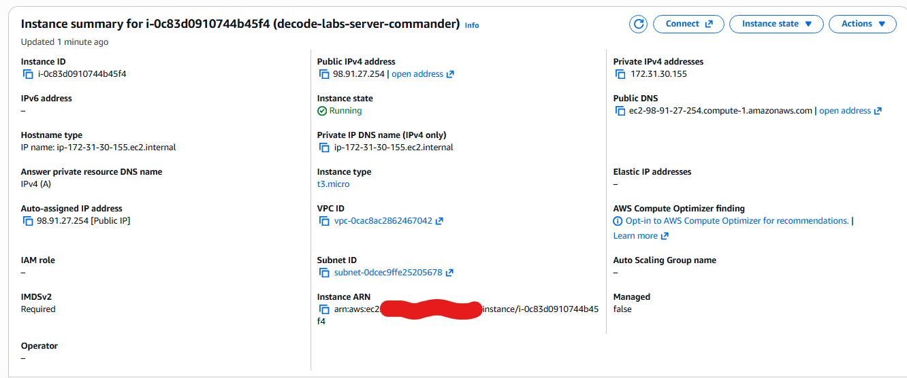
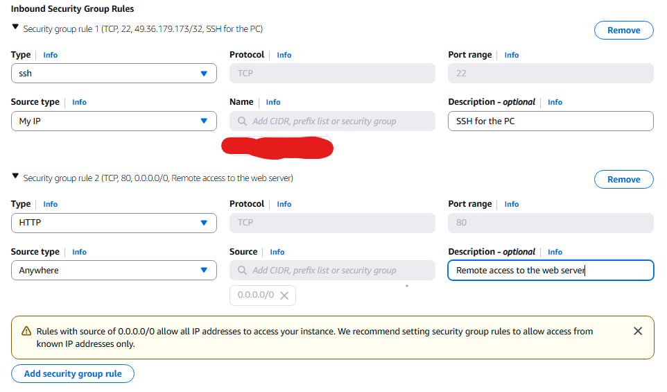
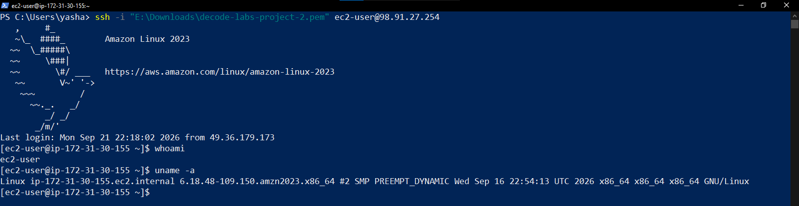
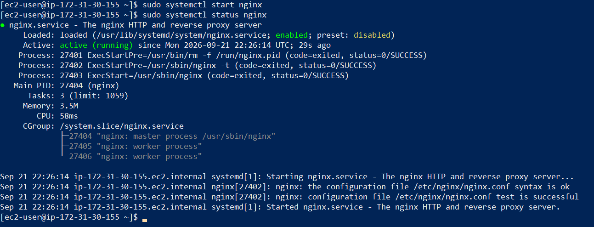
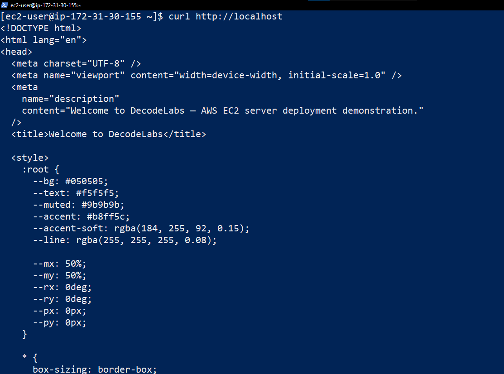
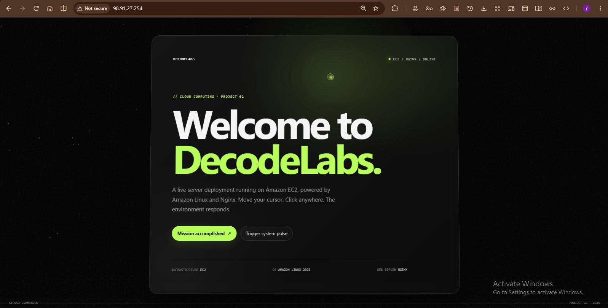

# Cloud Computing — Project 2: The Server Commander

## Live Deployment

**EC2 Public URL:**  
`http://YOUR-EC2-PUBLIC-IP`

The application is hosted on an **Amazon EC2 Linux instance** and served using **Nginx**.

---

## Project Objective

Provision a Linux virtual machine on Amazon EC2, secure access using a Security Group, connect to the server using SSH, install a web server, and host a custom **Welcome to DecodeLabs** webpage.

This follows the Project 2 requirements for:

- EC2 / Linux virtual machine
- SSH access
- Security Group configuration
- Nginx web server
- Custom webpage
- Public verification through the EC2 address

---

## Architecture

```text
Internet
   |
   | HTTP :80
   v
EC2 Public IPv4
   |
   v
Amazon Linux 2023
   |
   v
Nginx
   |
   v
/usr/share/nginx/html/index.html
```

SSH administration is restricted through the EC2 Security Group to the administrator's IP address.

---

# Deployment Procedure

## 1. Provision the EC2 Instance

An EC2 instance was launched using:

- **Cloud:** Amazon Web Services (AWS)
- **Service:** Amazon EC2
- **Operating System:** Amazon Linux 2023
- **Instance type:** `t3.micro`
- **Authentication:** EC2 key pair
- **Web server:** Nginx

The instance was assigned a public IPv4 address so the web server could be accessed from the internet.

---

## 2. Configure the Security Group

Inbound rules were configured as:

| Protocol | Port | Source | Purpose |
|---|---:|---|---|
| SSH | 22 | My IP | Secure administrative access |
| HTTP | 80 | `0.0.0.0/0` | Public web access |

SSH is restricted to the administrator's IP, while HTTP is publicly accessible so the hosted webpage can be viewed from a browser.

---

## 3. Connect Using SSH

The EC2 key pair was used to establish an SSH connection to the Amazon Linux instance.

Example:

```bash
ssh -i "decode-labs-project-2.pem" ec2-user@YOUR-EC2-PUBLIC-IP
```

The private key is kept locally and is **not included in this repository**.

---

## 4. Install and Start Nginx

Nginx was installed on the Amazon Linux instance and configured as the web server.

Example commands:

```bash
sudo dnf update -y
sudo dnf install nginx -y
sudo systemctl enable nginx
sudo systemctl start nginx
```

The service was verified with:

```bash
sudo systemctl status nginx
```

The expected state is:

```text
Active: active (running)
```

---

## 5. Deploy the Custom Webpage

The Nginx document root was identified as:

```text
/usr/share/nginx/html
```

The default `index.html` was replaced with the custom DecodeLabs webpage.

The deployed page includes:

- animated visual background
- mouse interaction
- click effects
- interactive buttons
- DecodeLabs welcome message
- EC2 / Nginx deployment information

After updating the page, the Nginx configuration was validated:

```bash
sudo nginx -t
```

and Nginx was reloaded:

```bash
sudo systemctl reload nginx
```

---

## 6. Verify the Deployment

The website was verified from a browser using the EC2 public IPv4 address:

```text
http://YOUR-EC2-PUBLIC-IP
```

The browser successfully displayed the custom:

```text
Welcome to DecodeLabs.
```

page served by Nginx.

---

# Evidence

The repository contains screenshots corresponding to the major deployment stages.

## 1. EC2 Instance Provisioned



Shows the running Amazon Linux EC2 instance and its public networking information.

## 2. Security Group



Shows:

- SSH port 22 restricted to the administrator's IP
- HTTP port 80 open for public web access

## 3. SSH Connection



Shows a successful SSH session into the Amazon Linux EC2 instance.

## 4. Nginx Running



Shows Nginx installed and running successfully.

## 5. Custom Webpage Deployed



Shows the custom HTML content being served by Nginx on the EC2 instance.

## 6. Live Website Verification



Shows the completed DecodeLabs webpage being accessed through the EC2 public IPv4 address.

---

# Repository Structure

```text
cloud-computing-project-2-ec2/
│
├── README.md
│
├── website/
│   └── index.html
│
└── screenshots/
    ├── 01-ec2-instance.png
    ├── 02-security-group.png
    ├── 03-ssh-connection.png
    ├── 04-nginx-running.png
    ├── 05-custom-page.png
    └── 06-live-website.png
```

---

## Task Outcome

The completed project demonstrates:

```text
EC2 provisioning
        ↓
Security Group configuration
        ↓
SSH access
        ↓
Amazon Linux administration
        ↓
Nginx installation
        ↓
Custom webpage deployment
        ↓
Public web verification
```

This repository contains the implementation and visual evidence for the complete deployment workflow.

---

## AWS Security Notes

- The SSH private key is **not** included in the repository.
- No AWS credentials or secret keys are stored in the repository.
- SSH access is restricted through the Security Group.
- HTTP is publicly accessible because the project requires a publicly reachable webpage.
- The EC2 instance is temporary infrastructure for this project and should be terminated after submission if it is no longer required.
